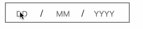
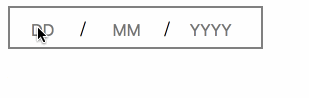
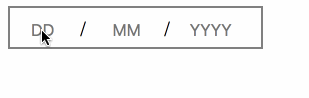

# Table of Contents

1.  [date-input](#orgb72a58e)
2.  [Examples](#orgcaea027)
    1.  [customize invalidError](#orgac6100a)
    2.  [add minDate validate and customized its errorMessage](#orgc3d798e)
    3.  [add maxDate validate and customized its errorMessage](#orgeca5c60)
    4.  [customize the whole validate rules, p.s. the default rules will lost](#org03c0a4d)
3.  [demo gif](#org0847101)
    1.  [type your date](#orgd4f3cb9)
    2.  [valdate when you blur it](#orgf7e3e45)
    3.  [validate when you type the full date](#org258fced)
4.  [Have a try ?](#org8be68eb)
5.  [Import in your project](#orgad53733)
6.  [Roadmap](#org472537d)

# date-input

a react component for date input, totally manual input field

available props

<table border="2" cellspacing="0" cellpadding="6" rules="groups" frame="hsides">

<colgroup>
<col  class="org-left" />

<col  class="org-left" />

<col  class="org-left" />

<col  class="org-left" />
</colgroup>
<tbody>
<tr>
<td class="org-left">Props</td>
<td class="org-left">description</td>
<td class="org-left">option?</td>
<td class="org-left">comment</td>
</tr>

<tr>
<td class="org-left">value</td>
<td class="org-left">the initial date Value</td>
<td class="org-left">yes</td>
<td class="org-left">format "YYYY-MM-DD"</td>
</tr>

<tr>
<td class="org-left">onChange</td>
<td class="org-left">callback function</td>
<td class="org-left">yes</td>
<td class="org-left">call when you type in any field</td>
</tr>

<tr>
<td class="org-left">onBlur</td>
<td class="org-left">callback function</td>
<td class="org-left">yes</td>
<td class="org-left">call when you blur the whole DateInput</td>
</tr>

<tr>
<td class="org-left">minDate</td>
<td class="org-left">the min date</td>
<td class="org-left">yes</td>
<td class="org-left">if the date you fill in is before minDate will get error, format "YYYY-MM-DD"</td>
</tr>

<tr>
<td class="org-left">minDateError</td>
<td class="org-left">customized errorMessage</td>
<td class="org-left">yes</td>
<td class="org-left">default errorMessage is "The date is too early"</td>
</tr>

<tr>
<td class="org-left">maxDate</td>
<td class="org-left">the max date</td>
<td class="org-left">yes</td>
<td class="org-left">if the date you fill in is after maxDate will get error, format "YYYY-MM-DD"</td>
</tr>

<tr>
<td class="org-left">maxDateError</td>
<td class="org-left">customized errorMessage</td>
<td class="org-left">yes</td>
<td class="org-left">default errorMessage is "The date is too late"</td>
</tr>

<tr>
<td class="org-left">invalidError</td>
<td class="org-left">customized errorMessage</td>
<td class="org-left">yes</td>
<td class="org-left">default errorMessage is "please input a valid date"</td>
</tr>

<tr>
<td class="org-left">rules</td>
<td class="org-left">customized validate rules</td>
<td class="org-left">yes</td>
<td class="org-left">the format should follow [{checker: value => fun(val), errorMessage: 'a string'}]</td>
</tr>
</tbody>
</table>

currently, we have default validate rules

    let defaultRules = [
      {
        checker: value => moment(dateValue, 'YYYY-MM-DD', true).isValid(),
        errorMessage: this.props.invalidError || 'please input a valid date',
      },
      //only when you pass minDate
      {
        checker: (value, option) => moment(dateValue).isSameOrAfter(option.minDate),
        errorMessage: this.props.minDateError || 'The date is too early',
      },
      //only validate when you pass maxDate
      {
        checker: (value, option) => moment(dateValue).isSameOrBefore(option.maxDate),
        errorMessage: this.props.maxDateError || 'The date is too late',
      },
    ];

Also, you are allowed to pass customized rules, just following the format above.

# Examples

## customize invalidError

    <DateInput invalidError="it is invalid date" />

## add minDate validate and customized its errorMessage

    <DateInput minDate="1990-01-01" minDateError="should before 1990-01-01" />

## add maxDate validate and customized its errorMessage

    <DateInput maxDate={moment().format('YYYY-MM-DD')} maxDateError="your birthday should be a past date" />

## customize the whole validate rules, p.s. the default rules will lost

    <DateInput rules={[{checker: value => moment().isBefore(value), errorMessage: 'the date should be the future date'}]} />

# demo gif

## type your date

## valdate when you blur it

## validate when you type the full date

# Have a try ?

    yarn install
    yarn storybook

then feel free to have a try

# Import in your project

    yarn add date-input

then date-input will appear in your package.json,

    import DateInput from 'date-input';

import this component in your source code

# Roadmap

-   [X] add props minDate and maxDate which can be exactly date or relative date.
-   [] add more validate Rules for user to choose, like [isFutureDate, isPastDate]
-   [] allow user to pass into customized validate rules, error messages
-   [] support date format like MM/YYYY, which is useful like expire date of credit card
-   [] support customized style

