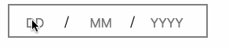

# Table of Contents

1.  [date-input](#orgf808469)
2.  [demo gif](#org211c850)
3.  [Have a try ?](#org19d169d)
4.  [Import in your project](#org3851fc7)

# date-input

a react component for date input, totally manual input field

# demo gif

# Have a try ?

    yarn install
    yarn storybook

then feel free to have a try

# Import in your project

    yarn add date-input

then date-input will appear in your package.json,

    import DateInput from 'date-input';

import this component in your source code

